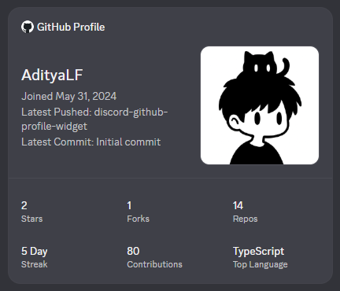

# Discord GitHub Profile Widget

[](https://nodejs.org/)

Automatically sync your GitHub profile to your Discord Profile Widget every hour using GitHub Actions.

## Preview




## Getting Started

> [!IMPORTANT]
> **Discord Profile Widgets (Experimental)**
>
> Discord Profile Widgets are currently an experimental feature. Follow [Chloe Cinders' Blog Guide](https://chloecinders.com/blog/discord-widgets#displaying-the-widget-on-your-profile) to enable the required Discord experiments, create and publish your widget, and add it to your Discord profile before continuing.

### 1. Fork this Repository
Click the **Fork** button at the top-right of this repository.

### 2.  Add Widget Fields
After creating your Discord Profile Widget, add the following fields under **Games -> Widget** in the Discord Developer Portal.

> [!NOTE]
> For a complete visual guide with screenshots showing how to configure each field in the Discord Developer Portal, please refer to the [docs/images](./docs/images) directory.


| Field | Type | Description |
| ------ | ---- | ----------- |
| `display_name` | String | GitHub display name |
| `username` | String | GitHub username |
| `joined` | String | GitHub account creation date |
| `avatar` | Media | GitHub profile avatar |
| `last_repo` | String | Most recently pushed repository |
| `last_commit` | String | Latest commit message |
| `stars` | Number | Total stars |
| `forks` | Number | Total forks |
| `repos` | Number | Total repositories |
| `streak` | String | Current contribution streak |
| `contributions` | Number | Contributions this year |
| `top_language` | String | Most used language |
| `followers` | Number | GitHub followers |
| `prs` | Number | Total pull requests |

### 3. Get Discord Credentials
1. Go to the [Discord Developer Portal](https://discord.com/developers) and select your app.
2. Copy the **Application ID** from General Information. (`DISCORD_APPLICATION_ID`)
3. Copy your Bot token from the **Bot** tab (click **Reset Token**). (`DISCORD_BOT_TOKEN`)
4. Click your profile in Discord and click **Copy User ID**. (`DISCORD_USER_ID`) (Note: If this option does not appear, enable **Developer Mode** first in Discord Settings -> Developer).

### 4. Create a GitHub Personal Access Token
1. Go to GitHub Settings -> Developer Settings -> Personal Access Tokens (Classic).
2. Generate a token with scopes: `read:user` and `repo` (or `public_repo`).
3. Copy the token. (`GH_PAT`)

### 5. Configure GitHub Secrets
1. Go to your forked repository's **Settings** tab.
2. In the left sidebar, click **Secrets and variables -> Actions**.
3. Under the **Secrets** tab (open by default), find **Repository secrets** section.
4. Click the **New repository secret** button.
5. Add the following secrets one by one by entering the **Name** and **Value** (ensure there are no leading or trailing spaces) and clicking **Add secret**:

| Secret Name | Description |
| :--- | :--- |
| `GH_USERNAME` | Your GitHub Username (e.g., `AdityaLF`) |
| `GH_PAT` | The GitHub Personal Access Token (from Step 4) |
| `DISCORD_APPLICATION_ID` | The Application ID of your Discord App (from Step 3) |
| `DISCORD_USER_ID` | Your Discord User ID (from Step 3) |
| `DISCORD_BOT_TOKEN` | The Discord Bot Token (from Step 3) |

### 6. Run the GitHub Action
1. Go to the **Actions** tab of your repository.
2. *(First time only)* If prompted, click **"I understand my workflows, go ahead and enable them"**.
3. In the left sidebar under **Workflows**, select **Update Discord Profile Widget**.
4. On the right side, click the **Run workflow** dropdown and click the green **Run workflow** button to trigger the sync manually.

## Local Development

1. Clone and install dependencies:
   ```bash
   git clone https://github.com/AdityaLF/discord-github-profile-widget.git
   cd discord-github-profile-widget
   npm install
   ```
2. Rename `.env.example` to `.env` in the root directory and fill:
   ```env
   # GitHub Configuration
   GH_USERNAME=your_github_username
   GH_PAT=your_github_personal_access_token

   # Discord Configuration
   DISCORD_APPLICATION_ID=your_discord_application_id
   DISCORD_USER_ID=your_discord_user_id
   DISCORD_BOT_TOKEN=your_discord_bot_token
   ```
3. Run the sync script:
   ```bash
   npm start
   ```

## Credits

Special thanks to [Chloe Cinders](https://chloecinders.com/blog/discord-widgets#displaying-the-widget-on-your-profile) for documenting Discord Profile Widgets and making this project possible.

## License

This project is licensed under the [MIT License](LICENSE).
